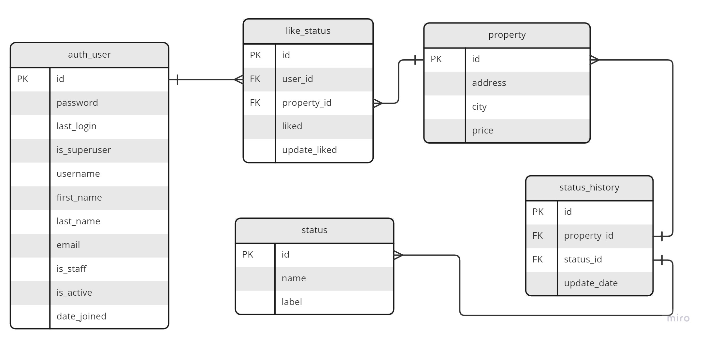

# TuHabi
# Proyecto Primera parte
# Filtrar consultas de propiedades

El proyecto consta de dos servicios funcionales. 
1.- Servicio sin filtrar
http://localhost:8088/properties/ ; en el cual se obtiene todos los datos sin filtrar

2.- Servicio para filtrado
http://localhost:8080/properties/filter?year=3000&city=bogota&status=en_venta; obtiene información filtrada con base a 3 atributos opcionales :
-   year    => Año de 1000 a 2999
-   city
-   status  => ['pre_venta', 'en_venta', 'vendido']

# Pasos para su realización
La primera tarea realizada fue verificar la conexión a la base de datos, por simplicidad se usó el software:
-   MySQL Workbench 8.0

Ya que el proyecto pide exlusivamente no usar frameworks, se procede a la investigación y pruebas de la librería:
- http de Python

Cuando se logra crear los endpoint se hace prueba de conexión de MySQL desde Python. 
A partir de éste punto, el trabajo se centra en el filtrado de las consultas. 
# Dependencias


Las librerías usadas para éste proyecto son las siguientes en Python 3.10.9:
- jsonschema==4.17.3
- mysql-connector-python==8.0.31

Se recomienda crear un entorno virtual y proceder a la instalación de dependencias:
    ```pip install -r requirements.txt```

Ejecución de proyecto con el siguiente comando:
    ```python main.py```

Una vez que el proyecto está corriendo, confirmar el dominio y puerto desde un mensaje como el siguiente ejemplo
- Server started http://localhost:8080

Importar la colección de postman que lleva por nombre:
- TuHabi.postman_collection

donde se encontrarán dos ejemplos previamente probados.

# Pruebas unitarias
Verificar que el servicio esté corriendo de forma local 
Ejecutar el comando: 
 ```python unitest_main.py```


# Proyecto: Segunda parte 
Para implementación de servicio donde el usuario indique qué propieda le gusta, se sugiere agregar en las tablas existentes La llaves principales de cada tabla y sus Llaves foraneas si se requiere, ésto para asegurar la que los datos insertados sí tengan relación con otras tablas.
Además que es necesario para crear la nueva tabla donde se guardará el Historico de "Likes" y ésta sea creada con relaciones de Llaves foráneas también.

El diagrama sugerido para las relaciones es el siguiente:



Se crea la llave primaria de la tabla habi_db.auth_users
	 ```ALTER TABLE auth_user
		ADD PRIMARY KEY (id); ```

Se crea la llave primaria de la tabla habi_db.property
	 ```ALTER TABLE property
		ADD PRIMARY KEY (id); ```

Se crea la llave primaria de la tabla habi_db.status
	 ```ALTER TABLE habi_db.status
		ADD PRIMARY KEY (id); ```

Se crea la llave primaria y foranea de la tabla habi_db.status_history
	 ```ALTER TABLE habi_db.status_history
		ADD PRIMARY KEY (id),
		ADD FOREIGN KEY (property_id) REFERENCES habi_db.property(id),
    		ADD FOREIGN KEY (status_id) REFERENCES habi_db.status(id); ```


Se crea la tabla de histórico de Likes con las siguientes características. De ésta manera dejamos la selección de elementos únicos en el query de Consulta. 

CREAR TABLA DE LIKES

 ```CREATE TABLE like_status (
    id int NOT NULL AUTO_INCREMENT ,
	user_id int not null,
    property_id int not null,
    liked bool,
	update_liked TIMESTAMP NOT NULL DEFAULT NOW(),
    PRIMARY KEY (id),
    FOREIGN KEY (user_id) REFERENCES auth_user(id),
	FOREIGN KEY (property_id) REFERENCES property(id)); ```

Para agregar un elemento a la tabla de "Likes" Se realiza indicando el id del usuario y el id de la propiedad a la que se le asigna un nuevo status de "Like"

Agregar un Like/Dislike
	 ```INSERT INTO like_status (user_id, property_id, liked)
	VALUES (1, 97, 1); ```

Para seleccionar  todos los usuarios que estén interesados en una propiedad específica (id de propiedad), se realiza con el siguiente Query, para el ejemplo el id de propiedad = 97


 ```select  property.id,
	property.address ,
	property.city ,
	property.price ,
	property.description,
    auth_user.username ,
    like_status.liked ,
    like_status.update_liked
from property
inner join  like_status on property.id = like_status.property_id
inner join auth_user on like_status.user_id = auth_user.id
WHERE like_status.liked = TRUE and
property.id = 97
GROUP BY auth_user.id
ORDER BY like_status.update_liked ; ```

Para seleccionar todas las propiedades que le interesen a un usuario en específico, se filtra por el id del usuario, para el siguiente ejemplo se realiza con el usuario de id = 11

 ```select  property.id,
	property.address ,
	property.city ,
	property.price ,
	property.description,
    auth_user.username ,
    like_status.liked ,
    like_status.update_liked
from property
inner join  like_status on property.id = like_status.property_id
inner join auth_user on like_status.user_id = auth_user.id
WHERE like_status.liked = TRUE and
like_status.user_id = 11
GROUP BY property.id
ORDER BY like_status.update_liked; ```


